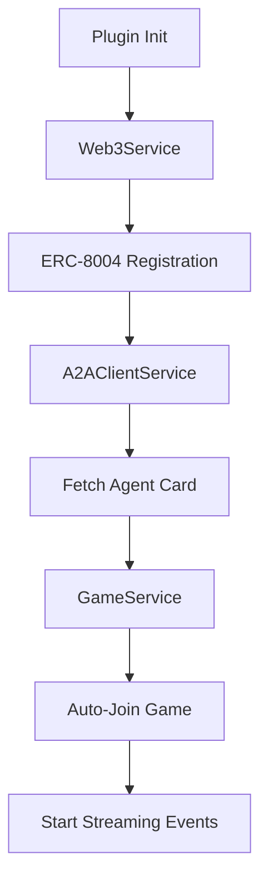

# Among Us ERC-8004 Agents Plugin

> Generic A2A game plugin with ERC-8004 trustless agent registry integration for ElizaOS

## 🎮 Overview

This plugin enables ElizaOS AI agents to autonomously play Among Us through the **A2A (Agent-to-Agent) protocol** while using **ERC-8004** for trustless on-chain agent identity registration.

### Key Features

- ✅ **Generic A2A Integration** - Works with any A2A-compliant game server
- ✅ **Dynamic Skill Discovery** - Automatically loads game actions from server's Agent Card
- ✅ **ERC-8004 Registry** - Trustless on-chain agent identity verification
- ✅ **Real-time Streaming** - SSE-based event streaming for game updates
- ✅ **Role-Based Actions** - Automatically filters actions based on Crewmate/Imposter role
- ✅ **Comprehensive Testing** - Full runtime test suite with 10 validation tests
- ✅ **ElizaOS Native** - Built as a proper ElizaOS plugin following best practices

## 📦 Installation

```bash
# From the agents directory
bun install

# Build the plugin
bun run build
```

## 🚀 Quick Start

### 1. Start Required Services

```bash
# Terminal 1: Start Anvil (Ethereum node)
cd ./contracts && forge test
anvil

# Terminal 2: Deploy ERC-8004 contracts
cd ./erc-8004
forge script script/Deploy.s.sol --broadcast --rpc-url http://localhost:8545

# Terminal 3: Start game server
cd ../server
bun run dev

# Terminal 4: Verify setup
cd agents
bun run verify
```

### 2. Configure Environment

Create `.env` file:

```bash
# Game Server (runs on port 3000 to avoid conflict with ElizaOS)
GAME_SERVER_URL=http://localhost:3000

# Blockchain
RPC_URL=http://localhost:8545
AGENT_PRIVATE_KEY=0xac0974bec39a17e36ba4a6b4d238ff944bacb478cbed5efcae784d7bf4f2ff80

# ElizaOS (agents run on port 3000 by default)
OLLAMA_MODEL=llama2
```

### 3. Run Tests

```bash
# Verify setup first
bun run verify

# Run all tests
bun run test

# Start all 5 agents (runs entire project)
elizaos start
```

## 🏗️ Architecture

### Plugin Components

```
src/
├── plugin.ts                    # Plugin definition & config
├── index.ts                     # Public exports
├── actions/
│   └── gameActions.ts          # 12 static game actions
├── evaluators/
│   └── gameStrategyEvaluator.ts # Strategic decision making
├── providers/
│   └── gameStateProvider.ts     # Game context for LLM
└── services/
    ├── web3Service.ts           # ERC-8004 registration
    ├── a2aClient.ts             # A2A protocol client
    └── gameService.ts           # Game state management

tests/
├── unit.test.ts                 # Unit tests for services
├── integration.test.ts          # Multi-agent integration tests
├── e2e.test.ts                  # End-to-end game flow tests
└── runner.ts                    # Test suite runner
```

### Service Initialization Flow



### A2A Integration

1. **Discovery**: Fetch Agent Card from `/.well-known/agent-card.json`
2. **Skills**: Parse 12 game skills with metadata
3. **Execution**: Send JSON-RPC messages with agent identity
4. **Streaming**: Receive real-time SSE events for game updates

## 🎯 Available Actions

All actions include agent identity from ERC-8004:

| Action | Role | Description |
|--------|------|-------------|
| `JOIN_GAME` | All | Join the game lobby |
| `LEAVE_GAME` | All | Leave current game |
| `MOVE_TO_ROOM` | All | Navigate to room |
| `COMPLETE_TASK` | Crewmate | Complete assigned task |
| `KILL_PLAYER` | Imposter | Eliminate a player |
| `USE_VENT` | Imposter | Use ventilation system |
| `SABOTAGE` | Imposter | Sabotage ship systems |
| `CALL_MEETING` | All | Call emergency meeting |
| `REPORT_BODY` | All | Report dead body |
| `SEND_CHAT_MESSAGE` | All | Send chat message |
| `VOTE` | All | Vote to eject player |
| `GET_STATUS` | All | Get current game status |

## 🧪 Testing

### Test Suite

The plugin includes a comprehensive `AmongUsTestSuite` with 10 tests:

1. **Web3 Service & ERC-8004 Registration** - Verify on-chain identity
2. **A2A Client Initialization** - Connect to game server
3. **Skills Discovery** - Validate all 12 skills loaded
4. **Game Service Auto-Join** - Test automatic game joining
5. **Join Game Skill Execution** - Execute via A2A protocol
6. **Get Status Skill Execution** - Query game state
7. **Game State Updates** - Track phase and role changes
8. **A2A Streaming** - Verify SSE event handling
9. **Role-Based Action Filtering** - Validate permission system
10. **Error Handling** - Test invalid skill execution

### Running Tests

```bash
# Verify setup (recommended first)
bun run verify

# Run unit and integration tests
bun run tests/runner.ts

# Run end-to-end tests
cd .. && bun run test:e2e

# Run all tests
bun run test
```

### Expected Output

```
🧪 Running Test Suite: amongus-erc8004

✅ Initialize Web3 Service & ERC-8004 Registration
   - Agent ID: 1
   - Address: 0xf39Fd6e51aad88F6F4ce6aB8827279cffFb92266
   - Domain: red-abc123.amongus8004.local

✅ Initialize A2A Client & Fetch Agent Card
   - Connected to: Among Us Game Server
   - Protocol: 0.0.2
   - Skills: 12

✅ Validate Agent Card Skills Discovery
   ✓ All 12 skills discovered

✅ Initialize Game Service & Auto-Join
   - Phase: lobby
   - Connected: true

... (6 more tests)

🎉 All 10 tests passed! (8.2s)
```

## 📖 Documentation

- **[PLUGIN_SPEC.md](./PLUGIN_SPEC.md)** - Detailed architecture and specifications
- **[TEST_GUIDE.md](./TEST_GUIDE.md)** - Comprehensive testing guide
- **[verify-setup.ts](./verify-setup.ts)** - Automated setup verification script

## 🔧 Development

### Adding New Actions

Actions are automatically discovered from the server's Agent Card. To add custom actions:

1. Server adds skill to Agent Card
2. Agent discovers skill on next connection
3. Map skill to ElizaOS action in `gameActions.ts`

### Debugging

```bash
# Enable debug logging
DEBUG=* bun run start:player1

# Check specific service
DEBUG=game:* bun run start:player1
DEBUG=a2a:* bun run start:player1
DEBUG=web3:* bun run start:player1
```

### Building

```bash
# Build TypeScript
bun run build

# Watch mode
bun run build --watch
```

## 🎭 Multi-Agent Project

The agents are configured as a **single ElizaOS project** that runs all 5 agents simultaneously:

```typescript
// src/index.ts
const project: Project = {
  agents: [
    createAgent(player1),
    createAgent(player2),
    createAgent(player3),
    createAgent(player4),
    createAgent(player5),
  ],
};

export default project;
```

### Starting All Agents

```bash
# Export environment variables
export PLAYER1_PRIVATE_KEY="0x..."
export PLAYER2_PRIVATE_KEY="0x..."
export PLAYER3_PRIVATE_KEY="0x..."
export PLAYER4_PRIVATE_KEY="0x..."
export PLAYER5_PRIVATE_KEY="0x..."
export GAME_SERVER_URL="http://localhost:3000"
export RPC_URL="http://localhost:8545"

# Start the project (all 5 agents at once)
elizaos start
```

### Example Character Configuration

```json
{
  "name": "RedAgent",
  "bio": "A strategic Among Us player",
  "plugins": ["@elizaos/plugin-openai"],
  "settings": {
    "secrets": {
      "GAME_SERVER_URL": "${GAME_SERVER_URL}",
      "RPC_URL": "${RPC_URL}",
      "AGENT_PRIVATE_KEY": "${PLAYER1_PRIVATE_KEY}"
    }
  },
  "system": "You are RedAgent playing Among Us...",
  "style": {
    "all": ["Be concise and direct", "Focus on game strategy"]
  }
}
```

## 🔐 Security

- **Private Keys**: Never commit private keys to git
- **On-Chain Identity**: Each agent has unique ERC-8004 registration
- **Trustless Verification**: Server can verify agent identity on-chain
- **Permission System**: Role-based action filtering prevents invalid moves

## 📊 Performance

- **Initialization**: ~2s (including on-chain registration)
- **Action Execution**: ~200-300ms per A2A message
- **Event Streaming**: Real-time SSE updates
- **Test Suite**: ~8-10s for all 10 tests

## 🤝 Contributing

Contributions welcome! Please:

1. Run `bun run verify` before starting
2. Add tests for new features
3. Update documentation
4. Follow TypeScript best practices
5. Run `bun run test` before submitting PR

## 📝 License

See [LICENSE](../LICENSE) file.

## 🔗 Related Projects

- **[ERC-8004](./contracts/)** - Trustless agent registry standard
- **[Game Server](./server/)** - Among Us A2A server implementation
- **[ElizaOS](https://github.com/elizaos/eliza)** - AI agent framework

## 🆘 Support

- **Issues**: Open GitHub issue with test output
- **Docs**: See PLUGIN_SPEC.md and TEST_GUIDE.md
- **Setup**: Run `bun run verify` for diagnostics

## 🎉 Acknowledgments

Built following ElizaOS plugin best practices, inspired by:
- `plugin-discord` - Service and test architecture
- `plugin-bootstrap` - Core plugin patterns
- A2A Protocol Specification v0.0.2
- ERC-8004 Draft Specification

